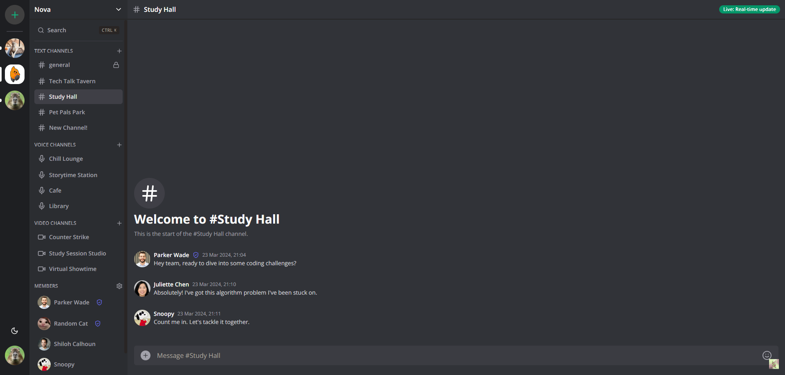

# LetsChat

LetsChat is a robust real-time messaging platform utilizing React.js and Next.js. It facilitates instant communication between users across diverse servers and channels. It is built with Next.js 14, React, Socket.IO, Prisma, Tailwind, and MySQL.


Feel free to register and try it: [LiveURL](https://discord-clone-production-76b6.up.railway.app)

Features:

- Real-time messaging using Socket.io
- Send attachments as messages using UploadThing
- Delete & Edit messages in real time for all users
- Create Text, Audio and Video call Channels
- 1:1 conversation between members
- 1:1 video calls between members
- Member management (Kick, Role change Guest / Moderator)
- Unique invite link generation & full working invite system
- Infinite loading for messages in batches of 10 (tanstack/query)
- Server creation and customization
- Beautiful UI using TailwindCSS and ShadcnUI
- Full responsivity and mobile UI
- Light / Dark mode
- Websocket fallback: Polling with alerts
- ORM using Prisma
- MySQL database using Aiven
- Authentication with Clerk

## Visual Overview

### You can share screen of face time with others in the video channels, or voice chat in the voice channels.


### As an admin or moderator, you can manage or kick members in the serever.


### As an admin or moderator, you can create new channels in the server.


### Created new channel: 


### You can invite other people with the randomly generated invite link if you are the admin or moderator. You can always generate a new link any time.


### Light/Dark mode change by clicking on the bottom left icon.



### You can edit your message by clicking on the icon to the right of the message.


### Other user can see the change at real time and the message will be marked as "edited"


### You can even delete your message, at real time of course.


### Prerequisites

**Node version 18.x.x**

### Cloning the repository

```shell
git clone https://github.com/shuyangConnor/LetsChat.git
```

### Install packages

```shell
npm i
```

### Setup .env file


```js
NEXT_PUBLIC_CLERK_PUBLISHABLE_KEY=
CLERK_SECRET_KEY=
NEXT_PUBLIC_CLERK_SIGN_IN_URL=
NEXT_PUBLIC_CLERK_SIGN_UP_URL=
NEXT_PUBLIC_CLERK_AFTER_SIGN_IN_URL=
NEXT_PUBLIC_CLERK_AFTER_SIGN_UP_URL=


DATABASE_URL=

UPLOADTHING_SECRET=
UPLOADTHING_APP_ID=

LIVEKIT_API_KEY=
LIVEKIT_API_SECRET=
NEXT_PUBLIC_LIVEKIT_URL=
```

### Setup Prisma

Add MySQL Database (I used Aiven)

```shell
npx prisma generate
npx prisma db push

```

### Start the app

```shell
npm run dev
```

## Available commands

Running commands with npm `npm run [command]`

| command         | description                              |
| :-------------- | :--------------------------------------- |
| `dev`           | Starts a development instance of the app |
